# 💬 Validate Commit Messages

A flexible GitHub composite action for validating commit messages against configurable JSON-based strategies with detailed error feedback.

## Overview


## Features

- **Multiple Validation Strategies**: Built-in support for Conventional Commits, RDK-B, Semantic Release, and custom formats
- **JSON-Based Configuration**: All strategies defined as JSON files with schema validation
- **JSON Schema Validation**: All strategy configs validated against [JSON Schema Draft-07](./strategies/schema.json)
- **Detailed Error Feedback**: Actionable error messages tailored to each strategy
- **Smart Annotations**: Minimal per-commit annotations plus one detailed summary annotation per strategy
- **Event Agnostic**: Works with push, pull_request, branch protection, and manual triggers
- **Handles Edge Cases**: Gracefully handles empty commits, force pushes, branch deletions, and rebases
- **Rate Limit & Retry**: Automatic retry with exponential backoff and rate limit detection

## Quick Start

### Basic Usage (Push Event)

```yaml
name: Validate Commits
on: push

jobs:
  validate:
    runs-on: ubuntu-latest
    steps:
      - uses: actions/checkout@v4
        with:
          fetch-depth: 0  # Required for commit history

      - name: Validate commit messages
        uses: rdkcentral/cmf-actions/actions/validate-commit-messages@main
        with:
          base-ref: ${{ github.event.before }}
          head-ref: ${{ github.sha }}
          strategy: 'conventional'
          github-token: ${{ secrets.GITHUB_TOKEN }}
```

### Pull Request Validation

```yaml
name: Validate PR Commits
on: pull_request

jobs:
  validate:
    runs-on: ubuntu-latest
    steps:
      - uses: actions/checkout@v4
        with:
          fetch-depth: 0

      - name: Validate PR commit messages
        uses: rdkcentral/cmf-actions/actions/validate-commit-messages@main
        with:
          base-ref: ${{ github.event.pull_request.base.sha }}
          head-ref: ${{ github.event.pull_request.head.sha }}
          strategy: 'conventional'
          github-token: ${{ secrets.GITHUB_TOKEN }}
```

## Available Strategies

| Strategy | Validation Scope | Description | Configuration |
|----------|------------------|-------------|---------------|
| **rdkb** | Full-message | RDK-B format with 7 required fields | [strategies/rdkb.json](./strategies/rdkb.json) |
| **conventional** | First-line | [Conventional Commits](https://www.conventionalcommits.org/) | [strategies/conventional.json](./strategies/conventional.json) |
| **semantic-release** | First-line | Semantic Release (feat/fix/perf/revert only) | [strategies/semantic-release.json](./strategies/semantic-release.json) |

All strategies are loaded from JSON configuration files. Custom strategies can be added by creating new JSON files in the `strategies/` directory.

## Input Parameters

| Input | Required | Default | Description |
|-------|----------|---------|-------------|
| `base-ref` | ✅ Yes | - | Base commit SHA or ref (e.g., `${{ github.event.before }}`) |
| `head-ref` | ✅ Yes | - | Head commit SHA or ref (e.g., `${{ github.sha }}`) |
| `strategy` | ✅ Yes | - | Validation strategy name (see Available Strategies) |
| `github-token` | ✅ Yes | - | GitHub token for API access (`${{ secrets.GITHUB_TOKEN }}`) |

### Understanding `base-ref` and `head-ref`

These inputs define the **commit range** to validate:

```mermaid
gitGraph
    commit id: "A"
    commit id: "B (base-ref)" type: HIGHLIGHT
    commit id: "C ✓" tag: "validated"
    commit id: "D ✓" tag: "validated"
    commit id: "E ✓ (head-ref)" type: REVERSE tag: "validated"
```



**Common Scenarios:**

| Event | base-ref | head-ref | Validates |
|-------|----------|----------|-----------|
| Push (one commit) | `github.event.before` | `github.sha` | New commit |
| Push (multiple) | `github.event.before` | `github.sha` | All new commits |
| Pull Request | `github.event.pull_request.base.sha` | `github.event.pull_request.head.sha` | All PR commits |
| Manual (last 5) | `HEAD~5` | `HEAD` | Last 5 commits |
| Branch range | `main` | `feature-branch` | All commits in feature |

## Output Parameters

| Output | Description | Example Value |
|--------|-------------|---------------|
| `is-valid` | Whether all commits passed validation | `true` or `false` |
| `invalid-commits` | Number of commits that failed validation | `3` |
| `commits-scanned` | Total number of commits discovered for validation | `10` |
| `error-details` | Detailed error messages for failed commits | Multi-line string |
| `expected-format` | Expected commit message format for the strategy | Multi-line string |
| `strategy-used` | Strategy that was applied | `conventional` |

### Using Outputs

```yaml
- name: Validate commits
  id: validate
  uses: rdkcentral/cmf-actions/actions/validate-commit-messages@main
  with:
    base-ref: ${{ github.event.before }}
    head-ref: ${{ github.sha }}
    strategy: 'conventional'
    github-token: ${{ secrets.GITHUB_TOKEN }}

- name: Post results
  if: always()
  run: |
    echo "Valid: ${{ steps.validate.outputs.is-valid }}"
    echo "Invalid count: ${{ steps.validate.outputs.invalid-commits }}"
    echo "Commits scanned: ${{ steps.validate.outputs.commits-scanned }}"
    echo "Strategy: ${{ steps.validate.outputs.strategy-used }}"
```

## Error Reporting & Annotations

When validation fails, the action provides feedback through multiple channels:

### GitHub Annotations

The action creates **minimal, focused annotations** to avoid clutter:

1. **Per-commit annotations** (from validator.js):
   - One minimal annotation per invalid commit
   - Format: `❌ Invalid: {sha}`
   - Automatically created by console output

2. **Summary annotation** (from action failure):
   - One detailed annotation per strategy
   - Contains full error list with commit details
   - Includes missing fields/components for each invalid commit

**Example for 2 invalid commits:**
```
❌ Invalid: abc1234
❌ Invalid: def5678
❌ 2 commit(s) do not match conventional format:

- abc1234: "bad commit message"
(Missing: type, scope)
- def5678: "another bad commit"
(Missing: type)
```

### Workflow Summary

The workflow can display comprehensive error details in the job summary using outputs:

```yaml
- name: Add job summary
  if: failure()
  run: |
    echo "## Validation Failed" >> $GITHUB_STEP_SUMMARY
    echo '```' >> $GITHUB_STEP_SUMMARY
    echo "${{ steps.validate.outputs.error-details }}" >> $GITHUB_STEP_SUMMARY
    echo '```' >> $GITHUB_STEP_SUMMARY
    echo "" >> $GITHUB_STEP_SUMMARY
    echo "### Expected Format" >> $GITHUB_STEP_SUMMARY
    echo '```' >> $GITHUB_STEP_SUMMARY
    echo "${{ steps.validate.outputs.expected-format }}" >> $GITHUB_STEP_SUMMARY
    echo '```' >> $GITHUB_STEP_SUMMARY
```

## How Strategies Relate to Schema & Error Feedback

### Schema Validation

All strategy configs **MUST** reference and comply with [strategies/schema.json](./strategies/schema.json):

```json
{
  "$schema": "./schema.json",
  "name": "conventional",
  "version": "1.0.0",
  "type": "first-line",
  "validation": { ... }
}
```

The schema enforces:
- ✅ Required fields (`name`, `version`, `type`, `validation`)
- ✅ Valid strategy types (`first-line` or `full-message`)
- ✅ Proper validation structure (depends on type)
- ✅ Pattern format (regex strings without delimiters)
- ✅ Metadata structure (examples, documentation links)

**Schema validation happens at runtime** when the action loads strategy files. Invalid configs cause the job to fail immediately with a clear schema violation error.

### How Config Affects Error Feedback

The action uses strategy config to generate **context-aware error messages**:

#### Example 1: First-Line Strategy (Conventional Commits)

**Config:**
```json
{
  "name": "conventional",
  "validation": {
    "pattern": "^(feat|fix|docs|style|refactor|perf|test|build|ci|chore|revert)(\\(.+\\))?:\\s+.+",
    "message": "Must follow Conventional Commits format"
  },
  "errorFormat": "Expected: <type>(<scope>): <description>\nValid types: feat, fix, docs, style, refactor, perf, test, build, ci, chore, revert"
}
```

**Error Output:**
```
❌ Commit message validation failed (conventional)

Invalid commits (2 out of 5):

1. abc1234 - "Add new login feature"
   ├─ Expected: <type>(<scope>): <description>
   ├─ Valid types: feat, fix, docs, style, refactor, perf, test, build, ci, chore, revert
   └─ Example: feat(auth): add OAuth2 support

2. def5678 - "fixed the bug"
   ├─ Expected: <type>(<scope>): <description>
   ├─ Valid types: feat, fix, docs, style, refactor, perf, test, build, ci, chore, revert
   └─ Example: fix(api): handle null pointer exception
```

**Key Config → Error Mappings:**
- `validation.pattern` → Used to test commit message
- `validation.message` → Appears in error summary
- `errorFormat` → Template for detailed error explanation
- `metadata.examples.valid` → Shown as guidance in error output

#### Example 2: Full-Message Strategy (RDK-E)

**Config:**
```json
{
  "name": "rdke",
  "type": "full-message",
  "validation": {
    "mode": "all-required",
    "fields": [
      {
        "name": "ticket",
        "pattern": "^RDKE-[0-9]+ :",
        "message": "Ticket number"
      },
      {
        "name": "component",
        "pattern": "Component\\s*:\\s*.+",
        "message": "Component field"
      },
      {
        "name": "testing",
        "pattern": "Testing\\s*:\\s*.+",
        "message": "Testing field"
      }
    ]
  },
  "errorFormat": "Expected RDK-E format:\nRDKE-XXXXX : <Title>\nComponent : ...\nTesting : ..."
}
```

**Error Output:**
```
❌ Commit message validation failed (rdke)

Invalid commits (1 out of 3):

1. ghi9012 - "RDKE-4567 : Add telemetry support"
   ├─ Missing required fields:
   │  • Component field
   │  • Testing field
   │
   ├─ Expected RDK-E format:
   │  RDKE-XXXXX : <Title>
   │  Component : ...
   │  Testing : ...
   │
   └─ Example:
      RDKE-1234 : Implement feature X
      Component : networking
      Testing : Unit tests added
```

**Key Config → Error Mappings:**
- `validation.fields[].name` → Identifies which field is missing
- `validation.fields[].message` → Human-readable field description
- `validation.fields[].pattern` → Tests for field presence
- `validation.mode: "all-required"` → Determines if all fields must be present
- `errorFormat` → Template shown when any field is missing

## Edge Cases & Error Handling

The action gracefully handles common Git edge cases:

```mermaid
flowchart TD
    Start[Action Triggered] --> CheckRefs{Check Commit<br/>Range}

    CheckRefs -->|base-ref = 0000...| Empty[Empty Range]
    CheckRefs -->|head-ref = 0000...| Empty
    CheckRefs -->|base-ref = head-ref| Empty
    CheckRefs -->|Valid range| CountCommits{Count Commits<br/>in Range}

    Empty --> ExitSuccess[✅ Exit Success<br/>No commits to validate]

    CountCommits -->|0 commits| ExitSuccess
    CountCommits -->|1 commit| ValidateSingle[Validate Single Commit]
    CountCommits -->|2-100 commits| ValidateMultiple[Validate All Commits]
    CountCommits -->|>100 commits| WarnAndValidate[⚠️ Warn + Validate All]

    ValidateSingle --> CheckValid{All Valid?}
    ValidateMultiple --> CheckValid
    WarnAndValidate --> CheckValid

    CheckValid -->|Yes| Success[✅ Pass<br/>is-valid=true]
    CheckValid -->|No| Fail[❌ Fail<br/>is-valid=false<br/>Show error details]

    Fail --> Protection{Branch Protection<br/>Enabled?}
    Protection -->|Yes| BlockMerge[🚫 Block Merge]
    Protection -->|No| ReportOnly[📋 Report Only]

    style Start fill:#ddf4ff,stroke:#0969da,color:#24292f
    style CheckRefs fill:#fff8c5,stroke:#d4a72c,color:#24292f
    style CountCommits fill:#fff8c5,stroke:#d4a72c,color:#24292f
    style Empty fill:#ffd8b5,stroke:#bc4c00,color:#24292f
    style ExitSuccess fill:#dafbe1,stroke:#1a7f37,color:#24292f
    style ValidateSingle fill:#fbefff,stroke:#8250df,color:#24292f
    style ValidateMultiple fill:#fbefff,stroke:#8250df,color:#24292f
    style WarnAndValidate fill:#fbefff,stroke:#8250df,color:#24292f
    style CheckValid fill:#fff8c5,stroke:#d4a72c,color:#24292f
    style Success fill:#dafbe1,stroke:#1a7f37,color:#24292f
    style Fail fill:#ffebe9,stroke:#d1242f,color:#24292f
    style Protection fill:#fff8c5,stroke:#d4a72c,color:#24292f
    style BlockMerge fill:#ffebe9,stroke:#d1242f,color:#24292f
    style ReportOnly fill:#ffd8b5,stroke:#bc4c00,color:#24292f
```



### Empty Commit Range

**Scenario**: Force push, branch deletion, or `base-ref == head-ref`

```yaml
# Example: Branch deleted
base-ref: abc1234
head-ref: 0000000000000000000000000000000000000000
```

**Behavior**: Action exits successfully with message "No commits to validate (empty range)"

### Single Commit Validation

**Scenario**: Push with exactly one new commit

```yaml
base-ref: ${{ github.event.before }}
head-ref: ${{ github.sha }}
# Only one commit between these refs
```

**Behavior**: Validates single commit, provides clear pass/fail feedback

### Multiple Commits Validation

**Scenario**: Push with 5 commits, PR with 20 commits

**Behavior**:
- Validates **all commits** in range (warns if >100 commits, see [Performance](#performance))
- Reports **each invalid commit separately**
- Fails if **any commit** is invalid
- Output includes statistics (e.g., "2 out of 20 commits invalid")

### Rebase & Force Push (History Rewrites)

**Scenario**: Developer force-pushes after rewriting Git history

This applies to any history rewriting operation:
- **Rebase**: `git rebase main` (commits get new SHAs)
- **Amend**: `git commit --amend` (changes commit SHA)
- **Interactive rebase**: `git rebase -i` to edit messages
- **Filter operations**: `git filter-branch` to batch-edit history

```yaml
# Example: After rebase or history rewrite
base-ref: abc1234  # Old branch head (before rewrite)
head-ref: def5678  # New branch head (after rewrite)
```

**Behavior**:
- Validates **all commits with new SHAs** (treats them as new commits)
- Ignores old commit history (they're no longer reachable)
- Catches any message changes made during rebase/amend
- Ensures rewritten commits still meet standards

**Why this matters**: If a developer rebases 10 commits or amends a message, all affected commits are re-validated. This prevents sneaking in non-compliant messages through history rewrites.

### Branch Protection Rules

**Scenario**: Branch ruleset requires commit validation

**Workflow Pattern:**
```yaml
on:
  push:
    branches: [main, develop, 'release/**']
```

**Behavior**: Blocks merge if any commit fails validation

## Example Workflows

### Production-Ready Workflow with Edge Cases

```yaml
name: Commit Message Validation
on:
  push:
    branches: ['**']  # All branches
  pull_request:
    types: [opened, synchronize, reopened]

jobs:
  validate-commits:
    name: 💬 Validate Commit Messages
    runs-on: ubuntu-latest

    # Skip validation on branch deletion
    if: github.event_name != 'delete'

    steps:
      - name: Checkout repository
        uses: actions/checkout@v4
        with:
          fetch-depth: 0  # Full history for commit range comparison

      # Determine commit range based on event type
      - name: Set commit range
        id: range
        run: |
          if [ "${{ github.event_name }}" = "pull_request" ]; then
            echo "base=${{ github.event.pull_request.base.sha }}" >> $GITHUB_OUTPUT
            echo "head=${{ github.event.pull_request.head.sha }}" >> $GITHUB_OUTPUT
          else
            echo "base=${{ github.event.before }}" >> $GITHUB_OUTPUT
            echo "head=${{ github.sha }}" >> $GITHUB_OUTPUT
          fi

      # Optional: Check for empty commit range before invoking action
      # Note: The action handles all edge cases internally, but this pre-check
      # can avoid unnecessary action invocation for obvious empty scenarios
      - name: Check commit range
        id: check
        run: |
          if [ "${{ steps.range.outputs.base }}" = "0000000000000000000000000000000000000000" ]; then
            echo "empty=true" >> $GITHUB_OUTPUT
          else
            echo "empty=false" >> $GITHUB_OUTPUT
          fi

      - name: Validate commit messages
        if: steps.check.outputs.empty == 'false'
        uses: rdkcentral/cmf-actions/actions/validate-commit-messages@main
        with:
          base-ref: ${{ steps.range.outputs.base }}
          head-ref: ${{ steps.range.outputs.head }}
          strategy: 'conventional'  # Change per project needs
          github-token: ${{ secrets.GITHUB_TOKEN }}
```

### Matrix Testing Multiple Strategies

```yaml
name: Test All Strategies
on: workflow_dispatch

jobs:
  test-strategies:
    name: Test ${{ matrix.strategy }}
    runs-on: ubuntu-latest
    strategy:
      matrix:
        strategy:
          - conventional
          - semantic-release
          - rdkb
          - rdke

    steps:
      - uses: actions/checkout@v4
        with:
          fetch-depth: 0

      - name: Validate with ${{ matrix.strategy }}
        uses: rdkcentral/cmf-actions/actions/validate-commit-messages@main
        with:
          base-ref: HEAD~10
          head-ref: HEAD
          strategy: ${{ matrix.strategy }}
          github-token: ${{ secrets.GITHUB_TOKEN }}
```

### Manual Validation Workflow

```yaml
name: Manual Commit Validation
on:
  workflow_dispatch:
    inputs:
      base-ref:
        description: 'Base ref (start of range, excluded)'
        required: true
        default: 'HEAD~10'
      head-ref:
        description: 'Head ref (end of range, included)'
        required: true
        default: 'HEAD'
      strategy:
        description: 'Validation strategy'
        required: true
        type: choice
        options:
          - conventional
          - semantic-release
          - rdkb
          - rdke

jobs:
  validate:
    runs-on: ubuntu-latest
    steps:
      - uses: actions/checkout@v4
        with:
          fetch-depth: 0

      - uses: rdkcentral/cmf-actions/actions/validate-commit-messages@main
        with:
          base-ref: ${{ inputs.base-ref }}
          head-ref: ${{ inputs.head-ref }}
          strategy: ${{ inputs.strategy }}
          github-token: ${{ secrets.GITHUB_TOKEN }}
```

## Creating Custom Strategies

See the comprehensive [Strategy Configuration Guide](./strategies/README.md) for:
- Step-by-step strategy creation
- First-line vs full-message validation modes
- JSON schema validation
- Pattern writing tips
- Error message customization
- Testing strategies locally

**Quick Template:**

```json
{
  "$schema": "./schema.json",
  "name": "my-org",
  "version": "1.0.0",
  "description": "My organization's commit format",
  "type": "first-line",
  "validation": {
    "pattern": "^(PROJ-[0-9]+):\\s+.+",
    "flags": "i",
    "message": "Must include project ticket reference"
  },
  "errorFormat": "Expected format: PROJ-123: Description",
  "metadata": {
    "examples": {
      "valid": ["PROJ-123: Add feature", "PROJ-999: Fix bug"],
      "invalid": ["Add feature", "PROJ: missing number"]
    },
    "documentation": "https://wiki.example.com/commit-guide"
  }
}
```

Save as `strategies/my-org.json`, then use with `strategy: 'my-org'`.

## Architecture

### Strategy Loading

All strategies are loaded from JSON files in the `strategies/` directory:

```json
{
  "$schema": "./schema.json",
  "name": "conventional",
  "version": "1.0.0",
  "type": "first-line",
  "validation": { /* ... */ }
}
```

**Features:**
- ✅ **Schema validation** - Runtime validation against schema.json
- ✅ **Extensible** - Add new strategies by dropping JSON files
- ✅ **Fast** - JSON parsing ~2-3ms per strategy

### Validation Flow

```mermaid
flowchart TD
    Start["1. Input: strategy, base-ref, head-ref"] --> Load["2. Load strategies/conventional.json"]

    Load --> Validate["3. Validate config against schema.json"]

    Validate -->|FAIL| SchemaError["❌ Throw schema violation error"]
    Validate -->|PASS| BuildValidator["✅ Build validator from config"]

    BuildValidator --> Fetch["4. Fetch commit range from GitHub API<br/>(with retry/rate limit handling)"]

    Fetch -->|0 commits| ExitSuccess["✅ Exit success<br/>(nothing to validate)"]
    Fetch -->|N commits| Continue["Continue to validation"]

    Continue --> ForEach["5. For each commit in range:"]

    ForEach --> CheckSkip{Check skip<br/>pattern?}
    CheckSkip -->|Enabled & matches| Skip["⏭️ Skip commit"]
    CheckSkip -->|Not skipped| ValidateType{Strategy type?}

    ValidateType -->|First-line| FirstLine["Test commit subject against pattern"]
    ValidateType -->|Full-message| FullMessage["Test entire message for<br/>all required fields"]

    FirstLine --> CollectResults["6. Collect invalid commits"]
    FullMessage --> CollectResults
    Skip --> CollectResults

    CollectResults --> GenerateErrors["7. Generate error messages<br/>using errorFormat + metadata"]

    GenerateErrors --> Output["8. Output:<br/>• is-valid=true/false<br/>• invalid-commits=N<br/>• strategy-used"]

    style Start fill:#ddf4ff,stroke:#0969da,color:#24292f
    style Load fill:#fbefff,stroke:#8250df,color:#24292f
    style Validate fill:#fff8c5,stroke:#d4a72c,color:#24292f
    style SchemaError fill:#ffebe9,stroke:#d1242f,color:#24292f
    style BuildValidator fill:#dafbe1,stroke:#1a7f37,color:#24292f
    style Fetch fill:#fbefff,stroke:#8250df,color:#24292f
    style ExitSuccess fill:#dafbe1,stroke:#1a7f37,color:#24292f
    style Continue fill:#ddf4ff,stroke:#0969da,color:#24292f
    style ForEach fill:#fbefff,stroke:#8250df,color:#24292f
    style CheckSkip fill:#fff8c5,stroke:#d4a72c,color:#24292f
    style Skip fill:#ffd8b5,stroke:#bc4c00,color:#24292f
    style ValidateType fill:#fff8c5,stroke:#d4a72c,color:#24292f
    style SinglePattern fill:#fbefff,stroke:#8250df,color:#24292f
    style MultiPattern fill:#fbefff,stroke:#8250df,color:#24292f
    style CollectResults fill:#ddf4ff,stroke:#0969da,color:#24292f
    style GenerateErrors fill:#fbefff,stroke:#8250df,color:#24292f
    style Output fill:#dafbe1,stroke:#1a7f37,color:#24292f
```




## Troubleshooting

### Enabling Debug Logging

To view detailed performance metrics and additional debugging information, enable debug logging in your workflow:

**Option 1: Repository Secret (Recommended for Development)**

1. Go to your repository **Settings** → **Secrets and variables** → **Actions**
2. Add a new repository secret:
   - Name: `ACTIONS_RUNNER_DEBUG`
   - Value: `true`
3. Re-run your workflow

**Option 2: Re-run with Debug Logging (One-time)**

1. Navigate to the failed workflow run
2. Click **Re-run jobs** → **Re-run jobs with debug logging**
3. This temporarily enables debug mode for that run only

**Option 3: Manual Workflow Dispatch**

```yaml
on:
  workflow_dispatch:
    inputs:
      debug:
        description: 'Enable debug logging'
        required: false
        type: boolean
        default: false

jobs:
  validate:
    runs-on: ubuntu-latest
    steps:
      - uses: actions/checkout@v4
        with:
          fetch-depth: 0

      - name: Validate commits
        uses: rdkcentral/cmf-actions/actions/validate-commit-messages@main
        with:
          base-ref: ${{ github.event.before }}
          head-ref: ${{ github.sha }}
          strategy: 'conventional'
          github-token: ${{ secrets.GITHUB_TOKEN }}
        env:
          RUNNER_DEBUG: ${{ inputs.debug && '1' || '' }}
```

**Debug Output Includes:**
- ⏱️ Performance metrics (strategy load time, validation time, avg per commit)
- 📊 Detailed commit statistics (found, skipped, validated, invalid)
- 🔍 Strategy loading information and caching status
- 📝 Complete validation flow with timing breakdowns

For more information, see [GitHub's documentation on enabling debug logging](https://docs.github.com/en/actions/monitoring-and-troubleshooting-workflows/enabling-debug-logging).

### Error: "Empty commit range"

**Cause**: `base-ref` equals `head-ref`, or one is `0000...`

**Solution**: Check your event payload:
```yaml
- run: |
    echo "Before: ${{ github.event.before }}"
    echo "After: ${{ github.sha }}"
```

### Error: "Strategy 'xyz' not found"

**Cause**: `strategies/xyz.json` doesn't exist

**Solution**:
1. Check available strategies in the [cmf-actions repository](https://github.com/rdkcentral/cmf-actions/tree/main/actions/validate-commit-messages/strategies)
2. Verify strategy name matches filename (without .json extension)
3. Ensure strategy file references schema: `"$schema": "./schema.json"`

### Error: "Validation config does not match schema"

**Cause**: JSON config violates [schema.json](./strategies/schema.json)

**Solution**:
```bash
# Validate your config
npm install -g ajv-cli
ajv validate -s strategies/schema.json -d strategies/your-strategy.json
```

### Error: "Pattern compilation failed"

**Cause**: Invalid regex in `validation.pattern`

**Solution**: Test regex separately:
```javascript
new RegExp("^(feat|fix):\\s+.+", "i")  // Should not throw
```

### Error: "No commits in push"

**Cause**: New branch creation or empty push

**Behavior**: Action exits successfully (nothing to validate)

## Performance

**Key Performance Features:**
- **Single API call**: All commits fetched in one request (no per-commit overhead)
- **Linear scaling**: Validation time scales linearly with commit count
- **Retry with backoff**: Automatic retry on network failures (3 attempts, exponential backoff)
- **Rate limit handling**: Detects and reports GitHub API rate limit exhaustion

### Performance Tips

**✅ Best Practices:**
```yaml
# Single validation call with broad range
- uses: rdkcentral/cmf-actions/actions/validate-commit-messages@main
  with:
    base-ref: HEAD~10
    head-ref: HEAD
    strategy: 'conventional'
```

**❌ Avoid:**
```yaml
# Multiple calls with same strategy (no benefit from caching across runs)
- uses: rdkcentral/cmf-actions/actions/validate-commit-messages@main
  with:
    base-ref: HEAD~10
    head-ref: HEAD~5
- uses: rdkcentral/cmf-actions/actions/validate-commit-messages@main
  with:
    base-ref: HEAD~5
    head-ref: HEAD
```

**Large Commit Ranges:**
- Action warns when validating >100 commits
- Performance remains linear but consider splitting validation
- Example: 500 commits ~2.1 seconds total

To contribute a new strategy, create your strategy JSON file and contribute it as a change to the repo.

## See Also

- [Strategy Configuration Guide](./strategies/README.md) - Create custom validation strategies
- [Schema Definition](./strategies/schema.json) - JSON schema for strategy configs
- [Conventional Commits](https://www.conventionalcommits.org/) - Industry standard format
- [Semantic Release](https://semantic-release.gitbook.io/) - Automated versioning
