# Strategy Configuration Guide

This directory contains validation strategy definitions for the validate-commit-messages action.

## Table of Contents

- [What is a Strategy?](#what-is-a-strategy)
- [Available Strategies](#available-strategies)
- [Strategy Architecture](#strategy-architecture)
- [Creating a Custom Strategy](#creating-a-custom-strategy)
- [Skip Configuration](#skip-configuration)
- [Error Messages & Feedback](#error-messages--user-feedback)
- [Testing Strategies](#testing-strategies-locally)
- [Contributing](#contributing-strategies)

## What is a Strategy?

A **strategy** defines the rules for validating commit messages. All strategies are defined as JSON configuration files that are loaded at runtime.

```mermaid
graph LR
    A[Commit] --> B[Load Strategy JSON]
    B --> C[Build Validator]
    C --> D[Validate]
    D --> E{Valid?}
    E -->|Yes| F[✅ Pass]
    E -->|No| G[❌ Fail]
```



## Available Strategies

| Strategy | Validation Scope | Format | Description |
|----------|------------------|--------|-------------|
| `rdkb` | Full-message | JSON | RDK-B format with 7 required fields |
| `conventional` | First-line | JSON | Conventional Commits specification |
| `semantic-release` | First-line | JSON | Semantic Release format (feat/fix/perf/revert only) |

## Strategy Architecture

### Validation Flow


### Strategy Types Comparison


## Using a Strategy

### In Your Workflow

```yaml
- uses: rdkcentral/cmf-actions/actions/validate-commit-messages@main
  with:
    base-ref: ${{ github.event.before }}
    head-ref: ${{ github.sha }}
    strategy: 'conventional'  # or rdkb, semantic-release, your-custom-strategy
    github-token: ${{ secrets.GITHUB_TOKEN }}
```

## Creating a Custom Strategy

### Step 1: Create Your Strategy File

Create a new JSON file in the `strategies/` directory (e.g., `my-org.json`). All strategies must be JSON files.

### Step 2: Choose a Strategy Type

Choose between **first-line** or **full-message** validation:

#### First-Line Strategy (Validates Commit Subject)

Use when validation is a single regex check on the first line.

**Example: Ticket-based commits**
```json
{
  "$schema": "./schema.json",
  "name": "custom-example",
  "version": "1.0.0",
  "description": "Example custom strategy template - copy and modify for your organization",
  "author": "Your Organization",
  "type": "first-line",
  "validation": {
    "pattern": "^\\[PROJ-[0-9]+\\]\\s+.+",
    "flags": "",
    "message": "Commit must start with ticket reference in brackets"
  },
  "errorFormat": "Expected format: [PROJ-<number>] <description>\n\nExample: [PROJ-123] Implement new feature",
  "skip": {
    "enabled": true,
    "pattern": "^(Merge |Revert |\\[bot\\])",
    "message": "🤖 Skipping automated commit: "
  },
  "metadata": {
    "examples": {
      "valid": [
        "[PROJ-123] Implement user login feature",
        "[PROJ-456] Fix database connection timeout",
        "[PROJ-789] Update documentation for API v2"
      ],
      "invalid": [
        "PROJ-123 Implement feature (missing brackets)",
        "[PROJ] Missing ticket number",
        "Implement feature (missing ticket reference)"
      ]
    },
    "documentation": "https://your-org.example.com/commit-guidelines"
  }
}
```

#### Full-Message Strategy (Validates Entire Commit Structure)

Use when commit message must contain multiple structured fields:

**Example 1: All fields required (AND logic)**
```json
{
  "$schema": "./schema.json",
  "name": "my-org",
  "version": "1.0.0",
  "description": "My organization's structured format",
  "type": "full-message",
  "validation": {
    "mode": "all",
    "fields": [
      {
        "name": "ticket",
        "pattern": "^TICKET-[0-9]+:",
        "message": "Ticket reference",
        "description": "First line must start with TICKET-XXX:"
      },
      {
        "name": "reviewed",
        "pattern": "Reviewed:\\s*(yes|no)",
        "flags": "i",
        "message": "Reviewed status",
        "description": "Must include: Reviewed: yes/no"
      }
    ]
  },
  "errorFormat": "Expected:\nTICKET-XXX: title\nReviewed: yes/no"
}
```

**Example 2: Any field required (OR logic)**
```json
{
  "$schema": "./schema.json",
  "name": "flexible-reference",
  "version": "1.0.0",
  "description": "Requires at least one type of reference",
  "type": "full-message",
  "validation": {
    "mode": "any",
    "fields": [
      {
        "name": "jira",
        "pattern": "JIRA-[0-9]+",
        "message": "JIRA ticket reference"
      },
      {
        "name": "github",
        "pattern": "#[0-9]+",
        "message": "GitHub issue reference"
      },
      {
        "name": "bugzilla",
        "pattern": "BUG[0-9]+",
        "message": "Bugzilla reference"
      }
    ]
  },
  "errorFormat": "Expected: At least one of JIRA-XXX, #XXX, or BUGXXX"
}
```

### Step 3: Add Skip Configuration (Optional)

Configure which commits to skip (e.g., merge commits, automated commits):

```yaml
skip:
  enabled: true
  pattern: '^Merge '  # Regex to match commits to skip
  message: '⏭️  Skipping merge commit: '  # Log message (SHA appended automatically)
```

#### Skip Configuration Flow

```mermaid
flowchart TD
    A[Commit Message] --> B{Skip<br/>Enabled?}
    B -->|No| E[Validate]
    B -->|Yes| C{Pattern<br/>Match?}
    C -->|Yes| D[⏭️ Skip<br/>Log message + SHA]
    C -->|No| E
    E --> F{Valid?}
    F -->|Yes| G[✅ Pass]
    F -->|No| H[❌ Fail with errors]
```



#### Common Skip Patterns

| Use Case | Pattern | Example Matches |
|----------|---------|-----------------|
| **Merge commits** | `^Merge ` | `Merge branch 'main'` |
| **Revert commits** | `^Revert ` | `Revert "Add feature"` |
| **Bot commits** | `^\\[bot\\]` | `[bot] Update deps` |
| **WIP commits** | `^(WIP\\|wip):` | `WIP: debugging` |
| **CI skip** | `\\[ci skip\\]` | `docs: update [ci skip]` |
| **Multiple** | `^(Merge \\|Revert \\|\\[bot\\])` | Any of the above |

**Example 1: Default (skip merges only)**
```yaml
skip:
  enabled: true
  pattern: '^Merge '
  message: '⏭️  Skipping merge commit: '
```

**Example 2: Skip automated commits**
```yaml
skip:
  enabled: true
  pattern: '^(Merge |\\[bot\\]|\\[dependabot\\]|Automated )'
  message: '🤖 Skipping automated commit: '
```

**Example 3: Disable skipping (validate everything)**
```yaml
skip:
  enabled: false
```

**Example 4: Organization-specific skip**
```yaml
skip:
  enabled: true
  pattern: '^(Merge |Revert |\\[infra\\])'
  message: '⏭️  Skipping special commit: '
```

### Step 4: Validate Against Schema

```bash
# Install a JSON schema validator
npm install -g ajv-cli

# Validate your strategy
ajv validate -s strategies/schema.json -d strategies/my-org.json
```

**Note on Pattern Validation**: All regex patterns (including field patterns in full-message strategies and skip patterns) are validated at runtime when the strategy loads. Invalid patterns will cause immediate failure with a clear error message.

**Note on Email/URL Patterns**: For fields like email or URLs, simplified patterns are often sufficient. The goal is typically to verify the field is present with a reasonable value, not to enforce full specification compliance (e.g., RFC 5322 for emails).

### Step 5: Test Your Strategy

```yaml
- uses: rdkcentral/cmf-actions/actions/validate-commit-messages@main
  with:
    strategy: 'my-org'  # Name matches my-org.json
    # ... other inputs
```

## Skip Configuration Deep Dive

### Testing Skip Patterns

```mermaid
graph TD
    A[Write Pattern] --> B[Test with regex101.com<br/>ECMAScript/JavaScript flavor]
    B --> C{Matches<br/>Expected?}
    C -->|No| D[Refine Pattern]
    D --> B
    C -->|Yes| E[Add to Strategy]
    E --> F[Test in Workflow]
    F --> G{Works?}
    G -->|No| H[Check Logs]
    H --> D
    G -->|Yes| I[✅ Deploy]
```



**Note**: When testing patterns on [regex101.com](https://regex101.com), select **ECMAScript (JavaScript)** as the flavor since the action uses JavaScript's `RegExp` engine.

### Pattern Syntax Guide

| Pattern | Description | Example Match |
|---------|-------------|---------------|
| `^Merge ` | Starts with "Merge " | `Merge branch 'main'` |
| `^Revert ` | Starts with "Revert " | `Revert "fix: bug"` |
| `\\[bot\\]` | Contains `[bot]` | `[bot] Update deps` |
| `^(A\\|B)` | Starts with A or B | `A: text` or `B: text` |
| `(?i)^merge` | Case-insensitive | `Merge` or `merge` |
| `\\[ci skip\\]` | Contains `[ci skip]` | `docs: update [ci skip]` |

### Troubleshooting Skip Patterns


## Schema Reference

### Required Fields

| Field | Type | Description |
|-------|------|-------------|
| `$schema` | string | Reference to schema.json (enables IDE validation) |
| `name` | string | Strategy identifier (lowercase-with-hyphens) |
| `version` | string | Semantic version (X.Y.Z) |
| `type` | string | Either `first-line` or `full-message` |
| `description` | string | Human-readable description of the strategy |
| `validation` | object | Validation rules (structure depends on type) |

### Optional Fields

| Field | Type | Description |
|-------|------|-------------|
| `author` | string | Author or organization |
| `errorFormat` | string | Template for error messages |
| `skip` | object | Configuration for skipping commits (see below) |
| `metadata` | object | Examples, documentation links, etc. |

### Skip Configuration

| Field | Type | Default | Description |
|-------|------|---------|-------------|
| `skip.enabled` | boolean | `true` | Enable/disable commit skipping |
| `skip.pattern` | string | `^Merge ` | Regex pattern to match commits to skip |
| `skip.message` | string | `⏭️  Skipping merge commit: ` | Log message prefix (SHA appended) |

## Pattern Writing Tips

### Pattern Syntax Diagram

```mermaid
graph LR
    A[Pattern Start] --> B[^]
    B --> C[Anchor: Line Start]

    D[Character Class] --> E[\\[A-Z\\]+]
    E --> F[One or more uppercase]

    G[Grouping] --> H[(feat\\|fix)]
    H --> I[Match feat OR fix]

    J[Quantifiers] --> K[+, *, ?, {n}]
    K --> L[Repetition control]

    M[End Anchor] --> N[$]
    N --> O[Anchor: Line End]
```

### First-Line Strategies

**Pattern**: JavaScript regex (without delimiters)
**Flags**: Standard regex flags (i=case-insensitive, m=multiline, etc.)

```json
{
  "validation": {
    "pattern": "^(feat|fix):\\s+.+$",
    "flags": "i"
  }
}
```

**Common Patterns:**
- `^` - Start of line
- `$` - End of line
- `\\s+` - One or more whitespace
- `[A-Z]+` - One or more uppercase letters
- `[0-9]+` - One or more digits
- `(a|b)` - Match 'a' or 'b'
- `.+` - One or more of any character

**Email Address Patterns:**

For email validation in commit messages, simplified patterns are recommended over full RFC 5322 compliance:

```regex
[a-zA-Z0-9._%+-]+@[a-zA-Z0-9.-]+\.[a-zA-Z]{2,}
```

**What this pattern validates:**
- ✅ Standard email formats: `user@example.com`, `first.last@company.co.uk`
- ✅ Plus addressing: `user+tag@example.com`
- ✅ Subdomains: `user@mail.subdomain.example.com`

**Known limitations (intentional for commit validation):**
- May accept consecutive dots: `user..name@example.com`
- May accept leading/trailing dots: `.user@example.com`
- Does not validate against full RFC 5322 specification
- Does not support quoted strings, comments, or IP address domains

**Why simplified patterns are sufficient:**
- 99.9% of real Git commit emails use standard formats
- Full RFC 5322 compliance requires extremely complex regex (hundreds of characters)
- Commit validation needs presence verification, not exhaustive validation
- Edge cases (quoted strings, comments) are never used in practice
- False positives (accepting slightly malformed addresses) are preferable to false negatives (rejecting valid addresses)

**Example from rdkb.json:**
```json
{
  "pattern": "Signed-off-by\\s*:\\s*[a-zA-Z0-9._%+-]+@[a-zA-Z0-9.-]+\\.[a-zA-Z]{2,}",
  "message": "Signed-off-by field (valid email)"
}
```

This pattern successfully validates developer signatures while keeping the regex maintainable and performant.

### Full-Message Strategies

Each field has its own pattern that searches the **entire commit message**:

```json
{
  "validation": {
    "mode": "all",
    "fields": [
      {
        "name": "title",
        "pattern": "^PROJ-[0-9]+:",
        "message": "Project ticket in title"
      },
      {
        "name": "approved",
        "pattern": "Approved-by:.+@.+\\..+",
        "flags": "i",
        "message": "Approval signature"
      }
    ]
  }
}
```

**Mode Options:**
- `all` - All fields must match (AND logic) - default if mode not specified
- `any` - At least one field must match (OR logic)

Both modes are fully implemented. The validator will apply the specified mode during commit message validation.

## Error Messages & User Feedback

### How Config Affects Error Messages

The action uses your config to provide detailed, context-aware error messages that are displayed in GitHub Action run logs, job summaries, and can be posted to pull request comments:

```mermaid
sequenceDiagram
    participant C as Commit
    participant V as Validator
    participant E as Error Builder
    participant A as Action Output

    C->>V: Commit message
    V->>V: Test against pattern
    alt Valid
        V-->>A: ✅ Pass
    else Invalid
        V->>E: Validation failed
        E->>E: Load errorFormat
        E->>E: Add examples from metadata
        E-->>A: ❌ Detailed error message<br/>(Posted to action logs,<br/>job summary, or PR comment)
    end
```



#### First-Line Errors

```json
{
  "name": "conventional",
  "errorFormat": "Expected format: <type>(<scope>): <description>\nValid types: feat, fix, docs"
}
```

**Output when validation fails:**
```
❌ 1 commit(s) don't follow conventional format:

- abc1234: "Add new feature"

Expected format: <type>(<scope>): <description>
Valid types: feat, fix, docs
```

**Config → Error Mapping:**
- `validation.pattern` → Tests commit message
- `errorFormat` → Error template
- `metadata.examples` → For strategy documentation only (not shown in error output)

#### Full-Message Errors

```json
{
  "name": "rdkb",
  "type": "full-message",
  "validation": {
    "fields": [
      {"name": "description", "message": "Description field"},
      {"name": "testing", "message": "Test Procedure field"}
    ]
  }
}
```

**Output when validation fails:**
```
❌ 1 commit(s) don't follow rdkb format:

- abc1234: "RDKB-123 : Fix bug" (Missing: Description field, Test Procedure field)

Expected RDK-B format:
<TICKET-NUMBER> : <Title>
Description : <Description>
...
```

### Using Examples in Config

The `metadata.examples` field is for **inline documentation only** and is never displayed to end users:

```json
{
  "metadata": {
    "examples": {
      "valid": [
        "feat: add feature",
        "fix(api): resolve bug"
      ],
      "invalid": [
        "add feature (missing type)",
        "fixed bug (wrong tense)"
      ]
    }
  }
}
```

**Purpose**: These examples exist purely as human-readable reference material within the strategy JSON file itself. They help:
- Strategy authors document the expected format while writing the config
- Code reviewers understand validation rules during pull request review
- Future maintainers quickly see valid/invalid examples without testing

**Not used for**: These examples are stored in the validator object but are intentionally **never included in validation error output**. Error messages remain concise and focused on the actual validation failure, using only `errorFormat` and field-specific `message` properties.

**When users see validation errors**, they receive:
- The commit SHA and message that failed
- Which fields are missing (for full-message strategies)
- The `errorFormat` text explaining the expected format
- **NOT** the examples from `metadata.examples`

## Advanced Configuration

### Regex Flags

| Flag | Description | Example Use Case |
|------|-------------|------------------|
| `i` | Case-insensitive | Accept "FEAT" or "feat" |
| `m` | Multiline mode | `^` matches line starts, not just string start |
| `s` | Dotall mode | `.` matches newlines |
| `g` | Global | Find all matches (not typically needed here) |

## Testing Strategies Locally

### Option 1: Manual Validation

```bash
# Test pattern against commit message
echo "feat: add feature" | grep -E "^(feat|fix):"
```

### Option 2: Schema Validation

```bash
# Validate JSON structure
ajv validate -s strategies/schema.json -d strategies/my-strategy.json
```

### Option 3: Action Test

Create a test workflow:

```yaml
name: Test Strategy
on: workflow_dispatch

jobs:
  test:
    runs-on: ubuntu-latest
    steps:
      - uses: actions/checkout@v4
        with:
          fetch-depth: 0

      - uses: rdkcentral/cmf-actions/actions/validate-commit-messages@main
        with:
          base-ref: HEAD~5
          head-ref: HEAD
          strategy: 'my-strategy'
          github-token: ${{ secrets.GITHUB_TOKEN }}
```

## Strategy Maintenance

### Versioning

Update `version` field when making changes:
- **Patch** (1.0.0 → 1.0.1): Fix typo in pattern/message
- **Minor** (1.0.0 → 1.1.0): Add optional field or examples
- **Major** (1.0.0 → 2.0.0): Change pattern that breaks existing commits

### Documentation

Always update:
- `description` - What the strategy validates
- `metadata.examples` - Show valid/invalid examples
- `metadata.documentation` - Link to full guidelines

## Testing Your Strategy

### Automated Validation

All strategy files are automatically tested by `strategies.test.js`:

```bash
cd actions/validate-commit-messages/strategies
node --test strategies.test.js
```

Tests verify:
- ✅ Valid JSON syntax
- ✅ Required fields present ($schema, name, version, type, description, validation)
- ✅ Valid type ('first-line' or 'full-message')
- ✅ Semantic versioning (X.Y.Z)
- ✅ All regex patterns compile successfully
- ✅ Naming convention (lowercase, numbers, hyphens)
- ✅ Filename matches strategy name
- ✅ Schema reference correct

### Manual Testing

Test your strategy locally:

```javascript
// Create test file: test-my-strategy.js
const { loadStrategy } = require('../validator.js');

const { validator } = loadStrategy('my-strategy', __dirname);

// Test valid message
console.log(validator.validate('feat: add feature')); // Should return true or {valid: true}

// Test invalid message
console.log(validator.validate('bad message')); // Should return false or {valid: false}
```

### Testing in CI

Your strategy will be automatically tested in CI when you:
1. Add `my-strategy.json` to the `strategies/` directory
2. Create a pull request
3. CI runs `strategies.test.js` which validates all JSON files
4. Integration tests run the action with your strategy

## See Also

- [Action README](../README.md) - How to use the validation action
- [Schema Definition](./schema.json) - Full JSON schema specification
- [Action Code](../action.yml) - Implementation details
- [Test Workflow](../../../.github/workflows/test-validate-commit-messages.yml) - CI configuration
